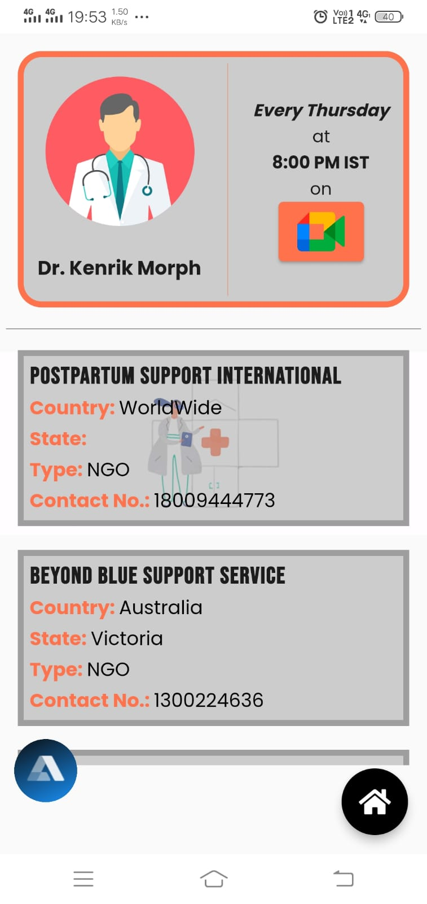

<div id="top"></div>
<!-- [![Contributors][contributors-shield]][contributors-url]
[![Forks][forks-shield]][forks-url]
[![Stargazers][stars-shield]][stars-url]
[![Issues][issues-shield]][issues-url]
[![MIT License][license-shield]][license-url]
[![LinkedIn][linkedin-shield]][linkedin-url] -->

<!-- PROJECT LOGO -->
<br />
<div align="center">
  <a href="https://github.com/triipaathii/dC">
    
  </a>

  <h2 align="center">dear Canary</h2>

  <p align="center">
    An Application for solving the problem of Postmartum Depression.
    <br />
    This is a Submission Project for Hackathon : 
    <a href="https://electrothon.specnith.com/">Electrothon 4.0</a>
    <br />
    <br />
    <a href="https://drive.google.com/file/d/1zbN4qylBrzryQmhiNH4WLDuymoOklK8O/view?usp=sharing"><strong>Download the App</strong></a>
    <br />
    <br />
    <a href="https://github.com/triipaathii/dC/issues">Report Bug</a>
    ·
    <a href="https://github.com/triipaathii/dC/issues">Request Feature</a>
  </p>
</div>

<!-- TABLE OF CONTENTS -->
<details>
  <summary>Table of Contents</summary>
  <ol>
    <li>
      <a href="#about-the-project">About The Project</a>
      <ul>
        <li><a href="#built-with">Built With</a></li>
      </ul>
    </li>
<!--     <li>
      <a href="#getting-started">Getting Started</a>
      <ul>
        <li><a href="#prerequisites">Prerequisites</a></li>
        <li><a href="#installation">Installation</a></li>
      </ul>
    </li> -->
    <li><a href="#vision">Our Vision</a></li>
    <!-- <li><a href="#roadmap">Roadmap</a></li> -->
<!--     <li><a href="#contributing">Contributing</a></li> -->
    <!-- <li><a href="#license">License</a></li> -->
    <li><a href="#team">Our Team</a></li>
    <!-- <li><a href="#acknowledgments">Acknowledgments</a></li> -->
  </ol>
</details>

<!-- ABOUT THE PROJECT -->

## About The Project

<div align="center">





</div>
<!-- [![Product Name Screen Shot][product-screenshot]](https://example.com) -->

The hand that cradles is the hand that rules the world

True right? It is beyond our imagination what all mother does for their children. Without them, the world would fall in a single day. But being a mother takes a lot from a woman. A woman endures physical, mental, emotional, and physiological tolls in order to give life. Conceiving a baby is universally known as a stressful thing but what about the woman’s health after giving birth? And here we are talking not just about her physical health but also about her mind.

Postpartum Depression is the mental disturbance phase new mothers go through. The birth of a baby can trigger a jumble of emotions in a woman’s mind. This is caused by the sudden change in hormones after delivery, combined with stress, isolation, sleep deprivation, and fatigue. One might feel more tearful, overwhelmed, and emotionally fragile during these days. The postpartum period generally commences after a couple of days of delivery and ends within two to three weeks postpartum. But some new moms can experience a more severe, long-lasting form of depression known as postpartum depression.

In the initial days, postpartum depression may seem like the normal baby blues. Often postpartum depression and baby blues share the same symptoms, but obviously, postpartum depression varies a lot. Suicidal thoughts or the inability to properly nurture your little one are the primary stark differences.

- Symptoms of postpartum depression
- Depressed mood or severe mood swings
- Excessive crying
- Difficulty bonding with your baby
- Withdrawing from family and friends
- Loss of appetite or eating much more than usual
- Inability to sleep (insomnia) or sleeping too much
- Overwhelming fatigue or loss of energy
- Reduced interest and pleasure in activities you used to enjoy
- Intense irritability and anger
- Fear that you're not a good mother
- Hopelessness
- Feelings of worthlessness, shame, guilt or inadequacy
- Diminished ability to think clearly, concentrate or make decisions
- Restlessness
- Severe anxiety and panic attacks
- Thoughts of harming yourself or your baby
- Recurrent thoughts of death or suicide

<p align="right">(<a href="#top">back to top</a>)</p>

### Built With

We have used the following tech for this Application :

- [Flutter](https://flutter.com/)
- [Alan AI](https://alan.app/)
- [Twilio](https://www.twilio.com/)
- [CockroachDB](https://www.cockroachlabs.com/)
- [Android Studio](https://developer.android.com/)
- [Photoshop](https://www.adobe.com/in/products/photoshop.html)
  

<p align="right">(<a href="#top">back to top</a>)</p>

<!-- GETTING STARTED -->

<!-- ## Getting Started

You can also Contribute to this project (LITTLE SPARROW) to make it more better and user friendly.

### Prerequisites

You need Flutter installed in your system to run this project

- To check
  ```sh
  flutter doctor
  ```

### Installation

Follow the following points to run this in your system

1.  Fork the repo

2.  Clone the repo
    ```sh
    git clone https://github.com/your_username_/Project-Name.git
    ```
3.  Enter in the project directory
    ```sh
    cd Project-Name
    ```
4.  Run it
    ```sh
    flutter run
    ```

<p align="right">(<a href="#top">back to top</a>)</p> -->

<!-- USAGE EXAMPLES -->

## Our Vision

We live in a world where half the population is female, and every female experiences the bliss of motherhood at some point in their life. The Postpartum Depression target rate is increasing with the increasing population. Nowadays, the global prevalence of PPD is 100-150 per 1000 births. PPD can be very toll taking on the health of a woman. We, at Little Sparrow, want to create a world where women can come up and break free of PPD. We want to live in a world where the masses know what Postpartum Depression is, and no one goes neglected. We want to create awareness among the crowd so that people can help new mothers in their struggles. The women community is progressing but somehow new mothers somewhere get neglected. Not being able to express their suffering hidden under joy can be a threat to their mental health. Little Sparrow wants to work for this cause believing that any type of mental health is a menace to everyone.

<p align="right">(<a href="#top">back to top</a>)</p>

<!-- CONTRIBUTING -->

<!-- ## Contributing

Contributions are what make the open source community such an amazing place to learn, inspire, and create. Any contributions you make are **greatly appreciated**.

If you have a suggestion that would make this better, please fork the repo and create a pull request. You can also simply open an issue with the tag "enhancement".
Don't forget to give the project a star! Thanks again!

1. Fork the Project
2. Create your Feature Branch (`git checkout -b feature/AmazingFeature`)
3. Commit your Changes (`git commit -m 'Add some AmazingFeature'`)
4. Push to the Branch (`git push origin feature/AmazingFeature`)
5. Open a Pull Request

<p align="right">(<a href="#top">back to top</a>)</p> -->

<!-- LICENSE -->
<!-- ## License

Distributed under the MIT License. See `LICENSE.txt` for more information.

<p align="right">(<a href="#top">back to top</a>)</p> -->

<!-- CONTACT -->

## Our Team

- Aastha Berry - [LinkedIn](https://www.linkedin.com/in/aastha-berry-582160203/)
- Abhay Kumar Mittal - [LinkedIn](https://www.linkedin.com/in/mitabhay/)
- Anurag Tripathi - [LinkedIn](https://www.linkedin.com/in/anurag-tripathi-7422291b4/)
- Stuti Srivastava - [LinkedIn](https://www.linkedin.com/in/stuti-srivastava-149192203/)

<!-- Project Link: [https://github.com/your_username/repo_name](https://github.com/your_username/repo_name) -->

<p align="right">(<a href="#top">back to top</a>)</p>

<!-- ACKNOWLEDGMENTS -->
<!-- ## Acknowledgments

Use this space to list resources you find helpful and would like to give credit to. I've included a few of my favorites to kick things off!

* [Choose an Open Source License](https://choosealicense.com)
* [GitHub Emoji Cheat Sheet](https://www.webpagefx.com/tools/emoji-cheat-sheet)
* [Malven's Flexbox Cheatsheet](https://flexbox.malven.co/)
* [Malven's Grid Cheatsheet](https://grid.malven.co/)
* [Img Shields](https://shields.io)
* [GitHub Pages](https://pages.github.com)
* [Font Awesome](https://fontawesome.com)
* [React Icons](https://react-icons.github.io/react-icons/search)

<p align="right">(<a href="#top">back to top</a>)</p> -->

<!-- MARKDOWN LINKS & IMAGES -->
<!-- https://www.markdownguide.org/basic-syntax/#reference-style-links -->

[contributors-shield]: https://img.shields.io/github/contributors/othneildrew/Best-README-Template.svg?style=for-the-badge
[contributors-url]: https://github.com/othneildrew/Best-README-Template/graphs/contributors
[forks-shield]: https://img.shields.io/github/forks/othneildrew/Best-README-Template.svg?style=for-the-badge
[forks-url]: https://github.com/othneildrew/Best-README-Template/network/members
[stars-shield]: https://img.shields.io/github/stars/othneildrew/Best-README-Template.svg?style=for-the-badge
[stars-url]: https://github.com/othneildrew/Best-README-Template/stargazers
[issues-shield]: https://img.shields.io/github/issues/othneildrew/Best-README-Template.svg?style=for-the-badge
[issues-url]: https://github.com/othneildrew/Best-README-Template/issues
[license-shield]: https://img.shields.io/github/license/othneildrew/Best-README-Template.svg?style=for-the-badge
[license-url]: https://github.com/othneildrew/Best-README-Template/blob/master/LICENSE.txt
[linkedin-shield]: https://img.shields.io/badge/-LinkedIn-black.svg?style=for-the-badge&logo=linkedin&colorB=555
[linkedin-url]: https://linkedin.com/in/othneildrew
[product-screenshot]: assets/images/screenshot.jpg
